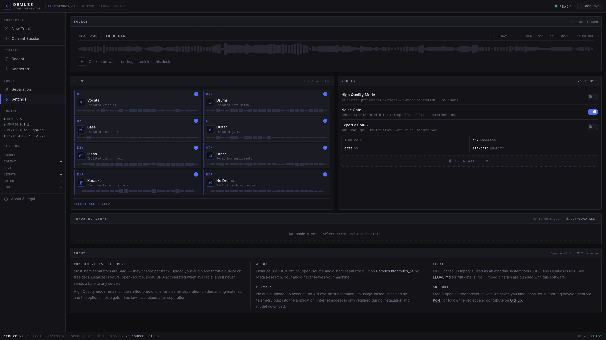
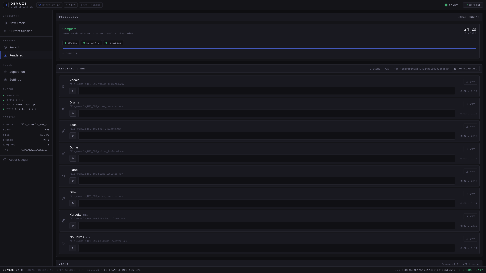

# Demuze

**Offline audio stem separation, running locally on your computer.**

Demuze is an open-source audio separation application built around Meta's Demucs `htdemucs_6s` model.

It lets you separate a track into vocals, drums, bass, guitar, piano and other instruments directly on your own machine. No account, cloud upload or subscription is required.

---

## Contents

* [Why Demuze](#why-demuze)
* [Features](#features)
* [Installation](#installation)
* [System Requirements](#system-requirements)
* [How It Works](#how-it-works)
* [Audio Quality](#audio-quality)
* [Comparison](#comparison)
* [Troubleshooting](#troubleshooting)
* [Legal & Licensing](#legal--licensing)
* [Project Structure](#project-structure)
* [Roadmap](#roadmap)
* [Contributing](#contributing)

---

## Why Demuze

Many audio separation services process your files on remote servers. That can be convenient, but it also means uploading your music and relying on a third-party service.

Demuze takes a local approach.

The application runs on your computer and processes audio locally. Your source files are not uploaded to a Demuze server, and the application does not require an account, subscription or API key.

Once the software and model have been installed, Demuze can be used without an internet connection.

The idea is simple: **keep the audio on your machine and give the user control over the processing.**

## Screenshot




---

## Features

### Stem separation

Demuze uses Demucs `htdemucs_6s` to produce six main stems:

* Vocals
* Drums
* Bass
* Guitar
* Piano
* Other

It can also create two additional mixes from the separated stems:

* **Karaoke** — instrumental mix with vocals removed
* **No Drums** — mix with drums removed

You can select only the stems you need before starting a separation.

### Processing options

* Standard separation mode for faster processing
* High Quality mode using multiple shifted predictions
* Optional noise-gate post-processing
* WAV output for lossless export
* MP3 output when smaller files are preferred
* GPU acceleration when supported by the system
* CPU processing when no compatible GPU is available

### Workflow

* Drag and drop an audio file into the application
* Supports common formats including MP3, WAV, FLAC, OGG, M4A and AAC
* Listen to generated stems directly in the browser
* Download individual stems
* Download all generated stems as a ZIP archive
* Clear and predictable output filenames

Example:

```text
MySong_vocals_isolated.wav
MySong_drums_isolated.wav
MySong_bass_isolated.wav
```

### Privacy

Demuze is designed to run locally:

* No audio upload to a cloud service
* No user account
* No API key
* No subscription
* No usage-based limits
* No telemetry or analytics built into the application
* Internet access is only required during installation and model download

---

## Installation

### macOS / Linux

Clone the repository and run the installer:

```bash
git clone https://github.com/Ama2eus/demuze.git
cd demuze

chmod +x install_and_run.sh
./install_and_run.sh
```

### Windows

Open PowerShell in the Demuze directory:

```powershell
cd demuze
.\install_and_run.ps1
```

The installer:

1. Checks the available Python version.
2. Checks whether FFmpeg is available.
3. Creates the Python virtual environment.
4. Installs the required Python packages.
5. Downloads the Demucs model weights during the first setup.
6. Starts the local application.
7. Opens Demuze in your browser.

FFmpeg is an external system dependency and is not bundled with Demuze. If it is missing, install it separately using the official FFmpeg distribution or your operating system's package manager.

After the first installation, the existing virtual environment and downloaded model can be reused for subsequent launches.

> **First installation:** PyTorch and the Demucs model can require a significant amount of disk space and download time. A stable internet connection is recommended during setup. Internet access is not required for normal local processing after the required packages and model have been installed.

---

## System Requirements

|            | Minimum                | Recommended                  |
| ---------- | ---------------------- | ---------------------------- |
| Python     | 3.10                   | 3.12                         |
| RAM        | 4 GB                   | 16 GB                        |
| Disk space | 5 GB                   | 10 GB                        |
| GPU        | Not required           | NVIDIA CUDA or Apple Silicon |
| FFmpeg     | Supported system build | Recent stable build          |

### Python versions

Demuze currently targets Python 3.10–3.12 because of the PyTorch version used by the project.

Python 3.13 and 3.14 are not currently supported by the project's pinned PyTorch environment.

### Approximate processing times

Processing time depends heavily on the CPU/GPU, audio format, track length and selected options.

For a three-minute track, typical ranges are approximately:

| Hardware      | Standard mode | High Quality mode |
| ------------- | ------------: | ----------------: |
| CPU only      |      5–15 min |         25–60 min |
| NVIDIA GPU    |     30–90 sec |           3–8 min |
| Apple Silicon |       1–3 min |          5–15 min |

These figures are only reference values. Actual performance can vary considerably between systems.

---

## How It Works

Demuze is a local web application.

When you start it:

1. A FastAPI server runs on `localhost`.
2. Your browser opens the Demuze interface.
3. The selected audio file is sent to the local application.
4. Demucs processes the file locally and generates the requested stems.
5. FFmpeg is used for mixing, post-processing and format conversion.
6. The resulting files are made available in the browser.
7. Temporary source files are removed after processing.

No audio is sent to a Demuze cloud service.

The browser communicates with the local FastAPI server running on your own machine.

### Architecture

```text
Browser
   │
   │ localhost
   ▼
FastAPI
   │
   │ subprocess
   ▼
Demucs
   │
   │ 6 source stems
   ▼
FFmpeg
   │
   ├── mixing
   ├── noise-gate processing
   └── format conversion
   │
   ▼
Output files
   │
   ▼
Browser
```

### Technology

* Python
* FastAPI
* Vanilla HTML/CSS/JavaScript
* PyTorch
* torchaudio
* Demucs
* FFmpeg

The frontend does not require a JavaScript framework or a separate build system.

---

## Audio Quality

Source separation is an estimation process. Even with a good model, some audio bleed and artifacts can remain in the resulting stems.

This is normal for neural source-separation systems and depends on the original recording.

### High Quality mode

Demuze's High Quality mode uses additional shifted predictions when running Demucs.

This takes considerably longer than the standard mode but can improve difficult separations and reduce some artifacts.

For final exports, High Quality mode is worth considering when processing time is not the main concern.

### Noise Gate

The optional noise-gate processing is applied after separation.

It is intended to reduce low-level residual sound from other stems. It cannot completely remove bleed and should be considered a post-processing step rather than a replacement for the separation model.

### For better results

Results generally improve when:

* the source recording is clean
* the target instrument is prominent in the mix
* the original arrangement has relatively clear separation between instruments
* WAV is used when lossless output is preferred
* High Quality mode is enabled for demanding material

---

## Comparison

The following table describes the general workflow offered by each project or service. Features and pricing of third-party products can change over time.

|                       | Demuze           | Moises                      | LALAL.AI                    | Ultimate Vocal Remover |
| --------------------- | ---------------- | --------------------------- | --------------------------- | ---------------------- |
| Local processing      | Yes              | Primarily cloud-based       | Cloud-based                 | Yes                    |
| Six-stem Demucs model | Yes              | No                          | No                          | Depends on model       |
| Browser interface     | Yes              | Yes                         | Yes                         | Desktop application    |
| ZIP export            | Yes              | Available depending on plan | Available depending on plan | Varies                 |
| Account required      | No               | Yes                         | Yes                         | No                     |
| Subscription required | No               | Optional/paid plans         | Paid usage available        | No                     |
| Open source           | Yes              | No                          | No                          | Yes                    |
| GPU acceleration      | CUDA / Apple MPS | Service-dependent           | Service-dependent           | Yes                    |

This comparison is provided for orientation only. Third-party products have their own models, interfaces, plans and licensing terms.

---

## Troubleshooting

### "FFmpeg not found"

FFmpeg must be available through your system PATH.

Install FFmpeg separately using your operating system's package manager or an official distribution, then restart the installer.

Demuze does not bundle FFmpeg.

### "TorchCodec is required" during separation

This usually indicates that an incompatible version of `torchaudio` has been installed.

Remove the existing virtual environment and run the installer again:

```bash
rm -rf .venv
./install_and_run.sh
```

The project pins the PyTorch/torchaudio versions required by the current environment.

### NumPy 2.x or `_ARRAY_API not found`

If the environment contains an incompatible NumPy version, recreate the virtual environment:

```bash
rm -rf .venv
./install_and_run.sh
```

The project's dependency configuration keeps NumPy compatible with the pinned PyTorch environment.

### Processing is very slow

CPU-only processing can take several minutes for a single track, especially in High Quality mode.

You can check whether PyTorch detects your GPU.

For NVIDIA:

```bash
source .venv/bin/activate
python -c "import torch; print(torch.cuda.is_available())"
```

For Apple Silicon:

```bash
source .venv/bin/activate
python -c "import torch; print(torch.backends.mps.is_available())"
```

### Port already in use

If the default port is already occupied, start Demuze on another port:

```bash
PORT=8080 ./install_and_run.sh
```

### Stems contain noticeable bleed

Some bleed is inherent to source separation.

Try:

* High Quality mode
* Noise Gate
* WAV output
* a cleaner source recording

The separation model is estimating individual sources from a mixed recording, so perfect isolation is not always possible.

---

## Legal & Licensing

Demuze is released under the **MIT License**. See [`LICENSE`](LICENSE) for the full license text.

### Demucs

Demuze uses the Demucs project and the `htdemucs_6s` model.

The Demucs source code is released under the MIT License by Meta Platforms, Inc. and its contributors.

Demucs is an external dependency of Demuze and is not presented as original Demuze code.

See the Demucs project and its license for the applicable terms.

### FFmpeg

FFmpeg is an external system dependency.

Demuze does not bundle or redistribute FFmpeg binaries. It invokes the FFmpeg executable available through the user's system PATH.

FFmpeg is generally distributed under the LGPL v2.1 or later, although optional components may be covered by the GPL. The exact licensing depends on how a particular FFmpeg build was compiled.

For this reason, users should obtain FFmpeg from a suitable distribution and review its applicable licensing terms.

See [`LEGAL.md`](LEGAL.md) for the project's licensing notes.

### PyTorch and torchaudio

Demuze uses PyTorch and torchaudio as third-party Python dependencies. Their respective licenses and notices apply to those components.

Third-party licenses are not replaced by the Demuze MIT License.

> **Important:** This section is intended as project documentation, not legal advice. Distributors who package Demuze together with third-party binaries or dependencies should review the applicable licenses for the exact distribution they intend to publish.

---

## Project Structure

```text
demuze/
├── backend
│   ├── main.py
│   └── requirements.txt
├── docs
│   └── screenshots
│       ├── Old-UI.png
│       ├── ui-main.png
│       └── ui-results.png
├── frontend
│   ├── index.html
│   └── static
│       ├── LEGAL.md
│       └── style.css
├── install_and_run.ps1
├── install_and_run.sh
├── installer
├── LICENSE
├── README.md
├── reset_and_reinstall.sh
```

`outputs/` and `temp/` are created as needed by the application.

---

## Roadmap

The roadmap is intentionally kept small and focused.

### Near term

* [ ] Waveform visualization for stems
* [ ] Batch processing
* [ ] Persistent job history

### Later

* [ ] Optional desktop application wrapper
* [ ] BPM and key detection
* [ ] Presets for common stem combinations

Features may change as the project develops.

---

## Contributing

Demuze is an open-source project and contributions are welcome.

### Bug reports

When opening an issue, include:

* operating system
* Python version
* CPU/GPU information when relevant
* the command used to start Demuze
* the complete error message or traceback

### Ideas and improvements

For larger changes, opening an issue before submitting a pull request is useful. It gives the project a chance to discuss the proposed change before implementation.

### Pull requests

Keep pull requests focused.

Small, self-contained changes are easier to review, test and maintain.

---

## Support

If Demuze is useful to you, you can support the project by:

* starring the repository
* reporting bugs
* improving documentation
* contributing code
* sharing the project with people who may find it useful

Financial support may be added through Ko-fi or GitHub Sponsors as the project grows.

---

<div align="center">

**Demuze**

*Local processing. Open source. Your audio stays on your machine.*

Built with Demucs, PyTorch, FastAPI and FFmpeg.

</div>
